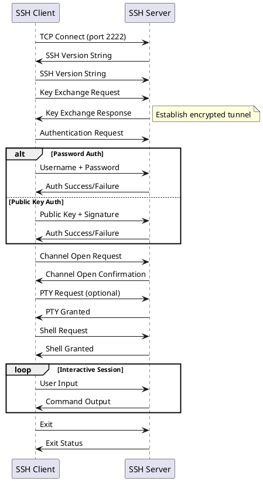
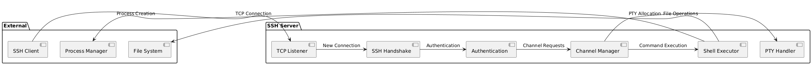
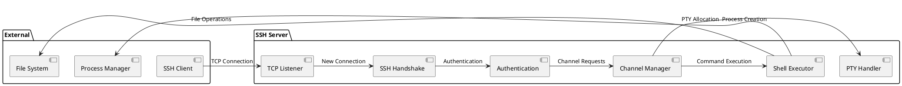
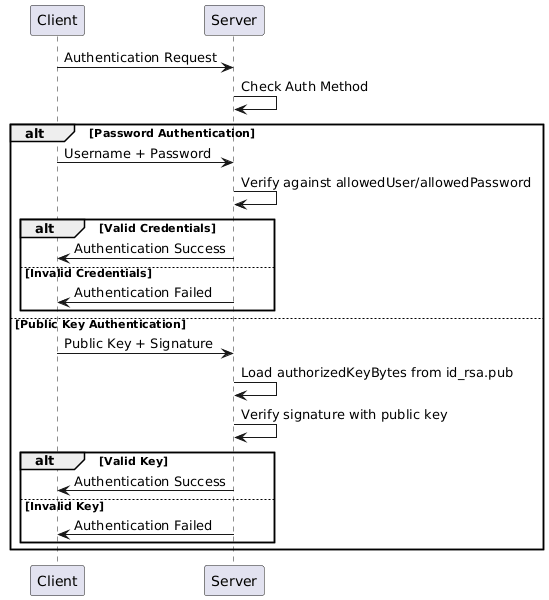
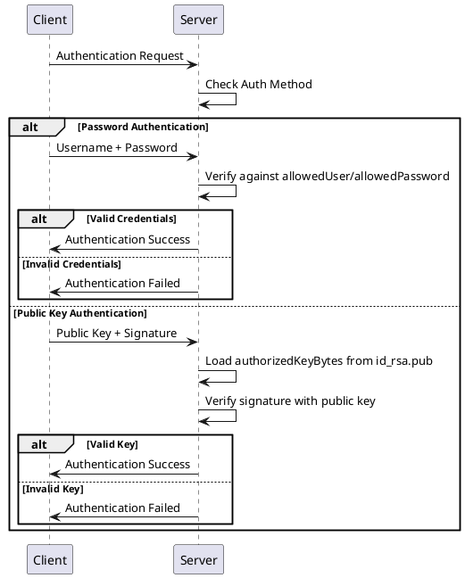
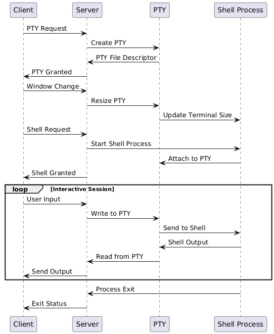
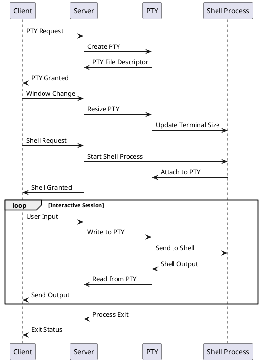

# SSH Server Implementation Explanation

## Overview
This document explains how SSH (Secure Shell) works and how our Go SSH server implementation handles the protocol.

## What is SSH?
SSH (Secure Shell) is a cryptographic network protocol for secure remote access and data communication. It provides:
- **Encrypted communication** between client and server
- **Authentication** mechanisms (password or public key)
- **Secure remote shell** access
- **File transfer** capabilities
- **Port forwarding** and tunneling

## SSH Protocol Flow

### 1. Connection Establishment
```
Client                    Server
  |                         |
  |---- TCP Connect ------->|
  |                         |
  |<---- SSH Version -------|
  |---- SSH Version ------->|
```

### 2. Key Exchange & Encryption Setup
```
Client                    Server
  |                         |
  |---- Key Exchange ------>|
  |<---- Key Exchange ------|
  |                         |
  |---- Encrypted Data ---->|
  |<---- Encrypted Data ----|
```

### 3. Authentication
```
Client                    Server
  |                         |
  |---- Auth Request ------>|
  |<---- Auth Challenge ----|
  |---- Auth Response ----->|
  |<---- Auth Success ------|
```

### 4. Session Management
```
Client                    Server
  |                         |
  |---- Channel Request ---->|
  |<---- Channel Open ------|
  |                         |
  |---- Shell Request ----->|
  |<---- Shell Granted -----|
  |                         |
  |---- Data -------------->|
  |<---- Data --------------|
```

## Our Go SSH Server Implementation

### Key Components

#### 1. Server Configuration
```go
config := &ssh.ServerConfig{
    PasswordCallback: func(c ssh.ConnMetadata, pass []byte) (*ssh.Permissions, error) {
        // Verify username/password
    },
    PublicKeyCallback: func(c ssh.ConnMetadata, key ssh.PublicKey) (*ssh.Permissions, error) {
        // Verify public key authentication
    },
}
```

#### 2. Connection Handling
- **TCP Listener**: Binds to `0.0.0.0:2222`
- **SSH Handshake**: Establishes encrypted connection
- **Channel Management**: Handles multiple concurrent sessions

#### 3. Authentication Methods

##### Password Authentication
- Username: `testuser`
- Password: `secret123`
- Server verifies credentials against hardcoded values

##### Public Key Authentication
- Server reads allowed public key from `id_rsa.pub`
- Client proves ownership of matching private key
- More secure than password authentication

#### 4. Session Types

##### Interactive Shell (with PTY)
- Client requests PTY allocation
- Server creates pseudo-terminal
- Handles window resizing
- Provides full interactive experience

##### Command Execution
- Client sends specific command
- Server executes command without PTY
- Returns command output and exit status

## PlantUML Diagrams

### SSH Connection Flow


<details>

<summary> plantuml</summary>



</details>

### Server Architecture




<details>

<summary> plantuml </summary>


</details>

### Authentication Flow



<details>

<summary> plantuml </summary>


</details>

### PTY and Shell Management



<details>

<summary> plantuml </summary>



</details>

## Key Features of Our Implementation

### 1. **Dual Authentication**
- Password authentication for simplicity
- Public key authentication for security

### 2. **PTY Support**
- Allocates pseudo-terminals for interactive sessions
- Handles window resizing
- Provides proper terminal environment

### 3. **Command Execution**
- Supports both interactive shells and command execution
- Proper exit status reporting
- Error handling and cleanup

### 4. **Concurrent Connections**
- Handles multiple simultaneous connections
- Goroutine-based connection handling
- Proper resource management

## Security Considerations

### 1. **Host Key Verification**
- Server uses private host key for identity
- Clients should verify host key fingerprint

### 2. **Authentication**
- Public key authentication is more secure than passwords
- Consider implementing additional security measures

### 3. **Network Security**
- All communication is encrypted
- Consider firewall rules and access controls

## Usage Examples

### Starting the Server
```bash
# Generate host key if needed
ssh-keygen -t rsa -b 2048 -f id_rsa -N ""

# Run the server
go run main.go
```

### Connecting with Password
```bash
ssh -p 2222 testuser@127.0.0.1
# Enter password: secret123
```

### Connecting with Public Key
```bash
# Copy your public key to id_rsa.pub
ssh -p 2222 testuser@127.0.0.1
```

### Executing Commands
```bash
ssh -p 2222 testuser@127.0.0.1 'ls -la'
```

## Cross-Platform Compatibility

This SSH server implementation works across different operating systems:
- **Windows**: Run with Go installed
- **macOS**: Native support
- **Linux**: Native support

Clients can connect from any SSH-compatible application regardless of the operating system.

## Conclusion

This Go SSH server implementation provides a solid foundation for understanding SSH protocol internals. It demonstrates key concepts like authentication, PTY management, and secure communication while maintaining simplicity for educational purposes.

For production use, consider additional features like:
- User management system
- Logging and auditing
- Advanced security measures
- File transfer capabilities (SFTP)
- Port forwarding support
